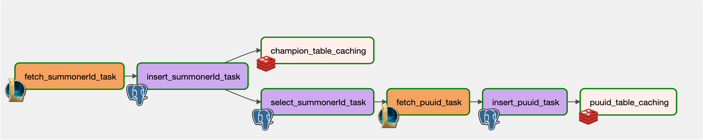
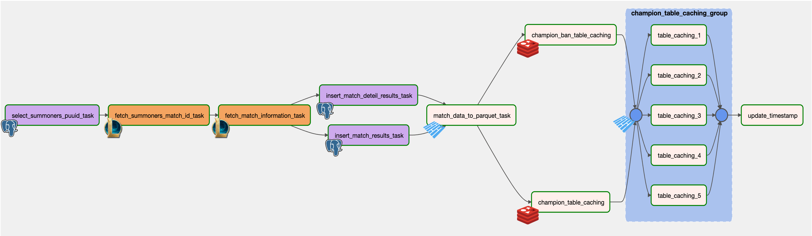
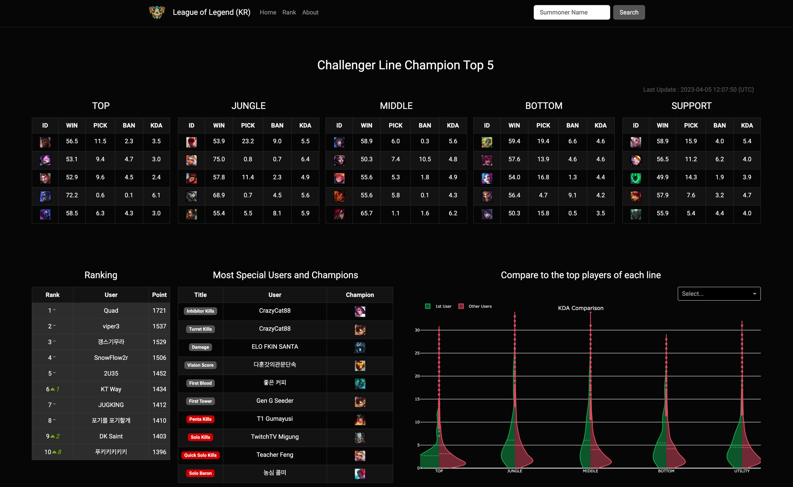

# Building Data Pipelines from Riot APIs with Airflow

[Riot API](https://developer.riotgames.com/apis)  

### Web  : [LOL hepler](https://www.lolhepler.com/)

## 데이터 수집

## 데이터 전처리
- 상위 라인 챔피언
- 상위 이벤트
- 데이터 평균

## 데이터 시각화
